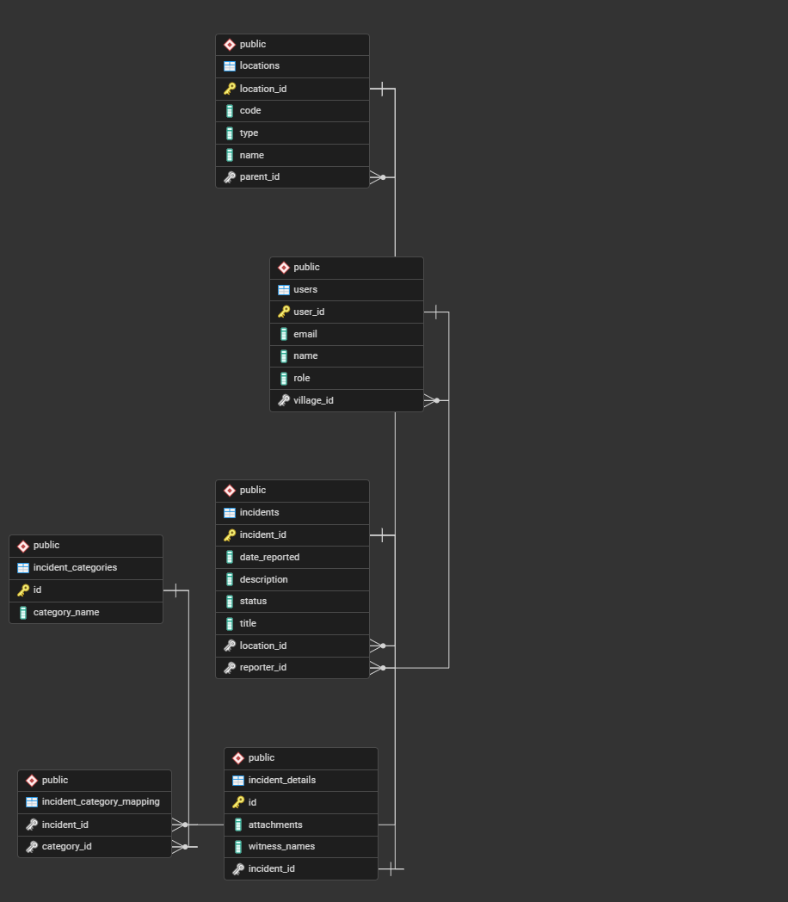
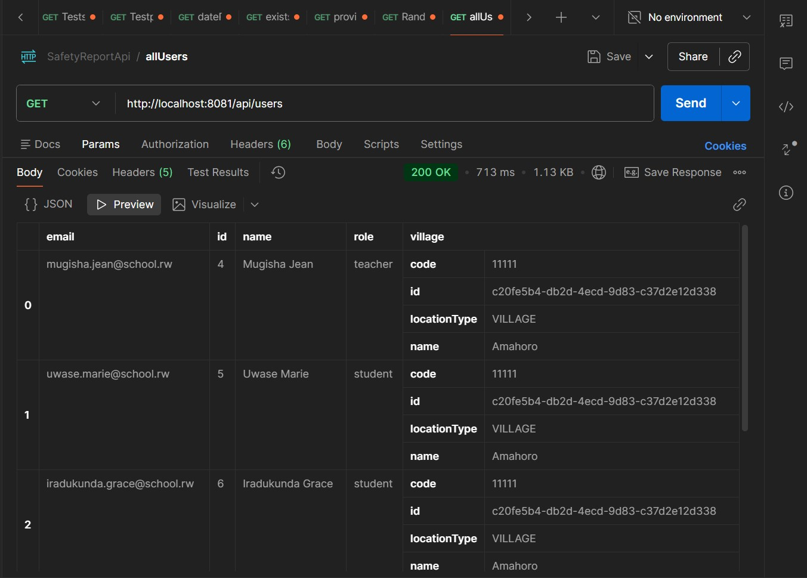
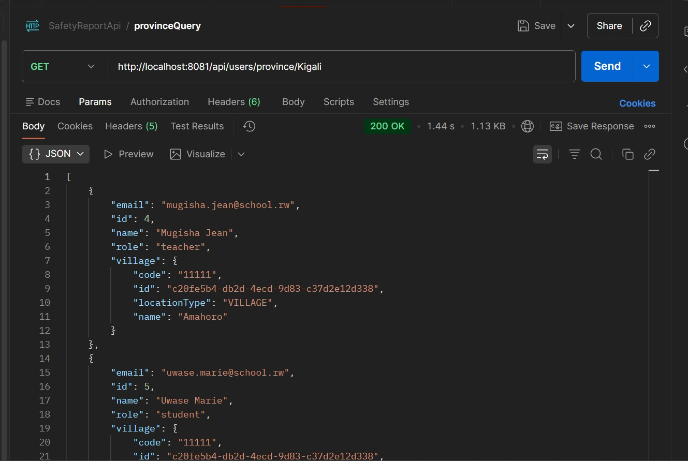
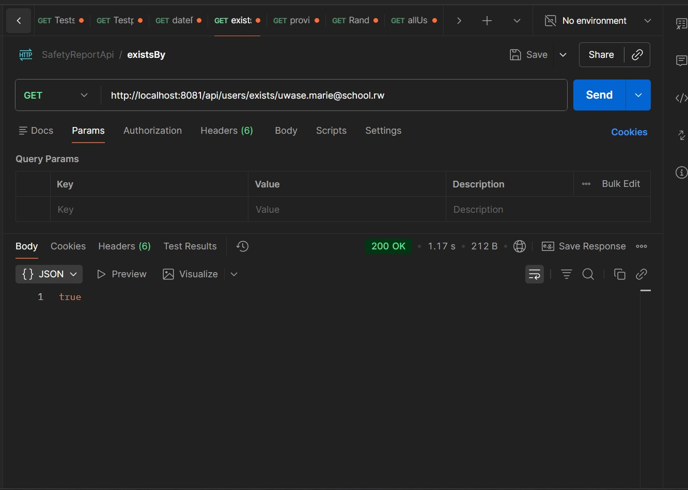
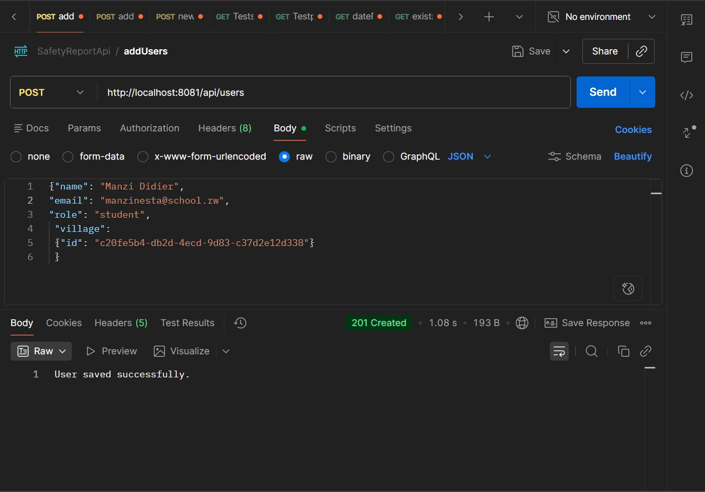
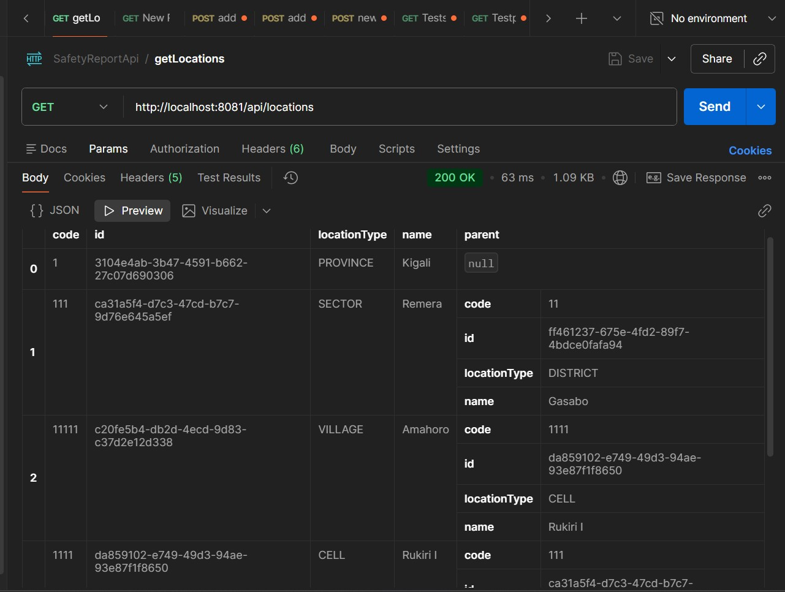
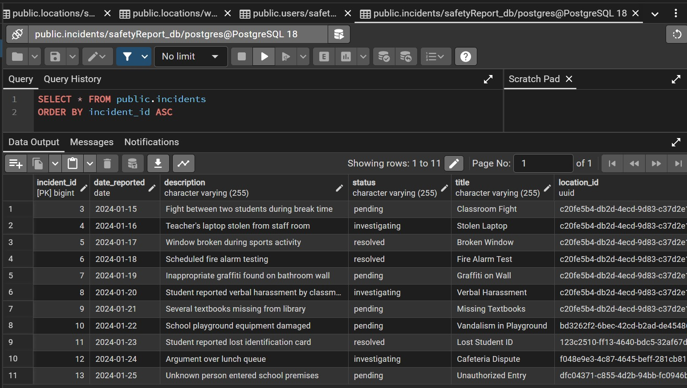
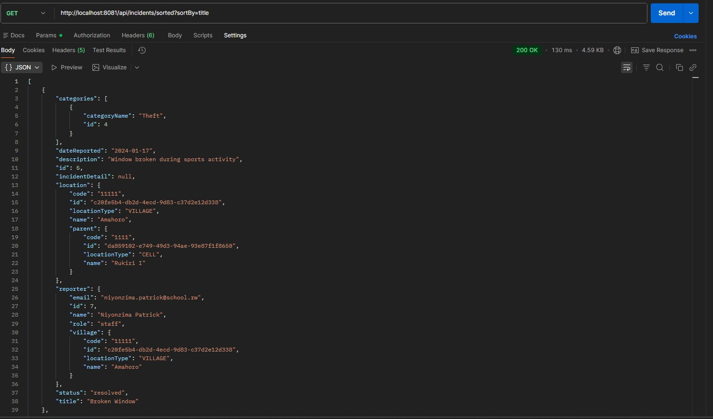
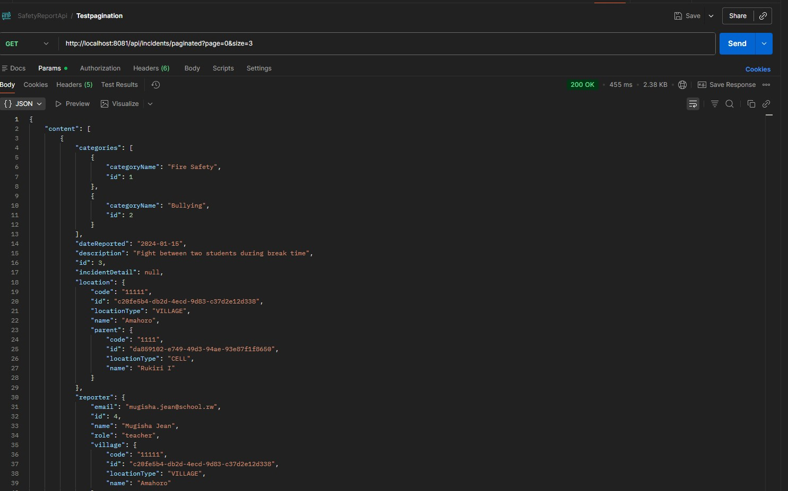
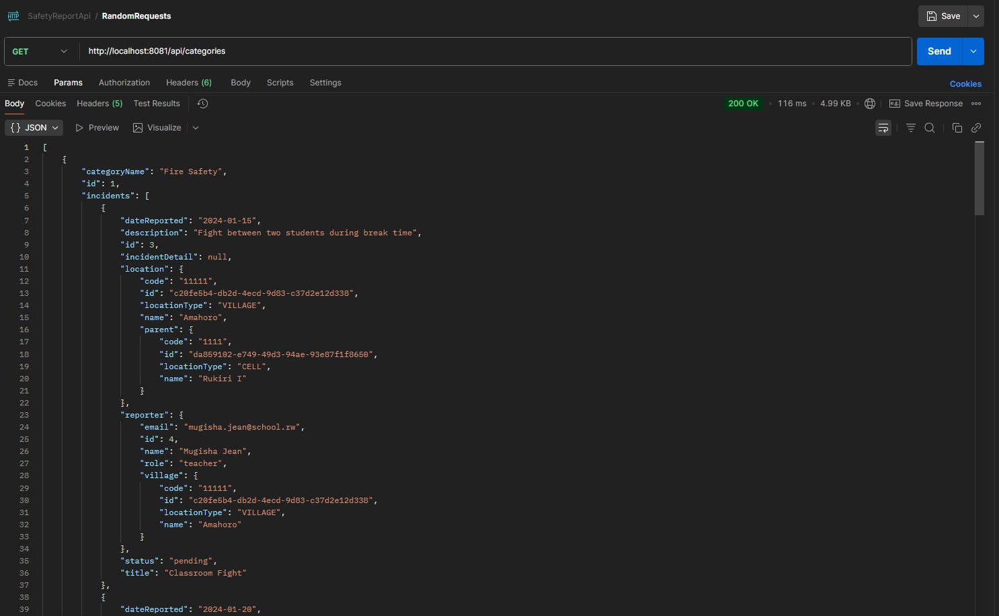

# School Safety Reporting System API

A comprehensive Spring Boot REST API for managing school safety incident reports with hierarchical location relationships and advanced database operations.

## 👨‍💻 Author

**Student Name:** Gaju Diego 

**Student ID:** 27395

**Course:** Web Technology and Internet

## Project Overview

This system enables schools to track and manage safety incidents efficiently. It implements a complete relational database structure with five interconnected entities, demonstrating advanced JPA relationships, pagination, sorting, and custom query methods.

**Developed for:** Mid-Semester Practical Assessment  
**Framework:** Spring Boot 4.0.3  
**Database:** PostgreSQL  
**Port:** 8081

---

## Key Features

- **Hierarchical Location Management** - Province → District → Sector → Cell → Village
- **Incident Reporting System** - Track safety incidents with detailed information
- **User Management** - Students, teachers, and staff with location-based filtering
- **Category Classification** - Multiple categories per incident (Many-to-Many)
- **Advanced Querying** - Sorting, pagination, and custom search methods
- **Relationship Integrity** - One-to-One, One-to-Many, and Many-to-Many relationships

---

## Database Schema

### Entity Relationship Diagram

The system consists of **5 interconnected tables**:

1. **Users** - Stores reporters (students, teachers, staff)
2. **Locations** - Hierarchical location structure (self-referencing)
3. **Incidents** - Central table for safety reports
4. **Incident Categories** - Classification types (Bullying, Theft, Fire Safety, Violence)
5. **Incident Details** - Extended information for incidents

### Relationships

| Relationship Type | Entities | Description |
|-------------------|----------|-------------|
| **One-to-Many** | User → Incident | One user can report multiple incidents |
| **One-to-Many** | Location → Incident | Multiple incidents can occur at one location |
| **Many-to-Many** | Incident ↔ Category | Incidents can have multiple categories |
| **One-to-One** | Incident → IncidentDetail | Each incident has one detailed record |
| **Self-Referencing** | Location → Location | Hierarchical location structure |



---

## Getting Started

### Prerequisites

- Java 17 or higher
- PostgreSQL 12+
- Maven 3.6+

### Database Setup

1. Create PostgreSQL database:
```sql
CREATE DATABASE safetyReport_db;
```

2. Update `application.properties`:
```properties
spring.datasource.url=jdbc:postgresql://localhost:5432/safetyReport_db
spring.datasource.username=postgres
spring.datasource.password=your_password
spring.jpa.hibernate.ddl-auto=update
server.port=8081
```

### Running the Application

```bash
mvn spring-boot:run
```

Or using Maven wrapper:
```bash
./mvnw spring-boot:run
```

Application will start at: `http://localhost:8081`

---

## API Endpoints

### User Management

#### Get All Users
```
GET /api/users
```


#### Get Users by Province
```
GET /api/users/province/{provinceName}
```
**Example:** `GET /api/users/province/Kigali`

This endpoint demonstrates the hierarchical location relationship. Users are linked to villages, which automatically connect to Cell → Sector → District → Province.



#### Check if User Exists
```
GET /api/users/exists/{email}
```
**Example:** `GET /api/users/exists/uwase.marie@school.rw`

Returns: `true` or `false`



#### Create New User
```
POST /api/users
Content-Type: application/json

{
  "name": "Uwase Marie",
  "email": "uwase.marie@school.rw",
  "role": "student",
  "village": {"id": "82b6335e-e8ab-4e1b-ac7f-c76d368e0d67"}
}
```
**Note:** Only village ID is required. The full hierarchy (Cell, Sector, District, Province) is automatically linked through relationships.



---

### Location Management

#### Get All Locations
```
GET /api/locations
```


#### Create Location
```
POST /api/locations
Content-Type: application/json

{
  "name": "Kigali",
  "code": "KGL",
  "locationType": "PROVINCE"
}
```

**Location Types:** `PROVINCE`, `DISTRICT`, `SECTOR`, `CELL`, `VILLAGE`

#### Create Child Location
```
POST /api/locations
Content-Type: application/json

{
  "name": "Gasabo",
  "code": "GSB",
  "locationType": "DISTRICT",
  "parent": {"id": "parent-location-uuid"}
}
```

---

### Incident Management

#### Get All Incidents
```
GET /api/incidents
```


#### Get Incidents with Sorting
```
GET /api/incidents/sorted?sortBy={field}
```
**Example:** `GET /api/incidents/sorted?sortBy=title`

**Sortable Fields:** `title`, `dateReported`, `status`



#### Get Incidents with Pagination
```
GET /api/incidents/paginated?page={page}&size={size}
```
**Example:** `GET /api/incidents/paginated?page=0&size=3`

**Response includes:**
- `content` - Array of incidents
- `totalPages` - Total number of pages
- `totalElements` - Total number of incidents
- `number` - Current page number
- `size` - Page size



#### Get Incidents with Sorting + Pagination
```
GET /api/incidents/sorted-paginated?page={page}&size={size}&sortBy={field}
```
**Example:** `GET /api/incidents/sorted-paginated?page=0&size=3&sortBy=dateReported`

#### Create New Incident
```
POST /api/incidents
Content-Type: application/json

{
  "title": "Classroom Fight",
  "description": "Fight between two students during break time",
  "dateReported": "2024-01-15",
  "status": "pending",
  "reporter": {"id": 1},
  "location": {"id": "82b6335e-e8ab-4e1b-ac7f-c76d368e0d67"},
  "categories": [{"id": 1}, {"id": 2}]
}
```

**Status Options:** `pending`, `investigating`, `resolved`

---

### Category Management

#### Get All Categories
```
GET /api/categories
```


#### Create Category
```
POST /api/categories
Content-Type: application/json

{
  "categoryName": "Bullying"
}
```

---

## Advanced Features

### 1. Hierarchical Location System

The location system uses a **self-referencing relationship** where each location can have a parent location:

```
Province (Kigali)
  └── District (Gasabo)
      └── Sector (Kimihurura)
          └── Cell (Kimihurura Cell)
              └── Village (Gisozi)
```

When creating a user, you only specify the **Village ID**. The system automatically maintains the connection to all parent locations through the `parent` relationship.

**Query Example:**
```java
@Query("SELECT u FROM User u WHERE u.village.parent.parent.parent.parent.name = :provinceName")
List<User> findByProvince(@Param("provinceName") String provinceName);
```

### 2. Pagination Benefits

Pagination improves performance by:
- **Memory Efficiency** - Only loads requested page into memory
- **Faster Response Time** - Database fetches only required rows using LIMIT/OFFSET
- **Better UX** - Large datasets split into manageable chunks
- **Network Efficiency** - Smaller payload reduces bandwidth usage

### 3. Many-to-Many Relationship

Incidents can have multiple categories, and categories can apply to multiple incidents. This is managed through a **join table**:

```sql
incident_category_mapping
--------------------------
incident_id (FK → incidents.id)
category_id (FK → incident_categories.id)
PRIMARY KEY (incident_id, category_id)
```

### 4. existsBy() Method

Spring Data JPA automatically generates optimized existence checks:

```java
boolean existsByEmail(String email);
```

Generates SQL:
```sql
SELECT CASE WHEN COUNT(u) > 0 THEN true ELSE false END 
FROM users u WHERE u.email = ?
```

More efficient than `findByEmail()` because it doesn't load the entire entity.

---

## Project Structure

```
schoolSafetyApi/
├── src/
│   ├── main/
│   │   ├── java/com/example/schoolSafetyApi/
│   │   │   ├── model/
│   │   │   │   ├── User.java
│   │   │   │   ├── Location.java
│   │   │   │   ├── LocationType.java (enum)
│   │   │   │   ├── Incident.java
│   │   │   │   ├── IncidentCategory.java
│   │   │   │   └── IncidentDetail.java
│   │   │   ├── repository/
│   │   │   │   ├── UserRepository.java
│   │   │   │   ├── LocationRepository.java
│   │   │   │   ├── IncidentRepository.java
│   │   │   │   ├── IncidentCategoryRepository.java
│   │   │   │   └── IncidentDetailRepository.java
│   │   │   ├── service/
│   │   │   │   ├── UserService.java
│   │   │   │   ├── LocationService.java
│   │   │   │   ├── IncidentService.java
│   │   │   │   └── IncidentCategoryService.java
│   │   │   ├── controller/
│   │   │   │   ├── UserController.java
│   │   │   │   ├── LocationController.java
│   │   │   │   ├── IncidentController.java
│   │   │   │   └── IncidentCategoryController.java
│   │   │   └── SchoolSafetyApiApplication.java
│   │   └── resources/
│   │       └── application.properties
│   └── test/
├── Screenshots/
├── pom.xml
└── README.md
```

---

## Testing

All endpoints have been tested using **Postman**. Test the complete workflow:

1. **Create Location Hierarchy** (Province → District → Sector → Cell → Village)
2. **Create Categories** (Bullying, Theft, Fire Safety, Violence)
3. **Create Users** (with village ID only)
4. **Create Incidents** (with reporter, location, and categories)
5. **Test Queries:**
   - Get users by province
   - Sort incidents by title/date
   - Paginate incidents
   - Check user existence

---

## Technologies Used

| Technology | Version | Purpose |
|------------|---------|---------|
| Spring Boot | 4.0.3 | Application framework |
| Spring Data JPA | - | Database operations |
| PostgreSQL | 12+ | Relational database |
| Hibernate | - | ORM implementation |
| Maven | 3.6+ | Build tool |
| Java | 17 | Programming language |

---

## Sample Data

### Location Hierarchy
**Province:** Kigali  
**District:** Gasabo  
**Sectors:** Remera, Kacyiru, Kimihurura  
**Cells:** Rukiri I, Kamatamu, Kibagabaga Cell  
**Villages:** Amahoro, Kiyovu, Nyamirambo, Kimironko, Nyarutarama, Kibagabaga, Gisozi, Rebero

### Users (9 total)
- Uwase Marie (Student) - Amahoro
- Mugisha Jean (Teacher) - Amahoro
- Iradukunda Grace (Student) - Amahoro
- Niyonzima Patrick (Staff) - Amahoro
- Mukamana Alice (Student) - Amahoro
- Uwera Diane (Teacher) - Nyamirambo
- Mutoni Sarah (Student) - Kimironko
- Nkusi David (Staff) - Nyarutarama
- Ingabire Claire (Student) - Kibagabaga

### Categories
- Bullying
- Violence
- Theft
- Fire Safety

### Incidents (11 total)
- Classroom Fight
- Stolen Laptop
- Broken Window
- Fire Alarm Test
- Graffiti on Wall
- Verbal Harassment
- Missing Textbooks
- Vandalism in Playground
- Lost Student ID
- Cafeteria Dispute
- Unauthorized Entry

---

---

## License

Educational project for academic assessment purposes.

---

## Support

For questions or issues, please contact your course instructor.
